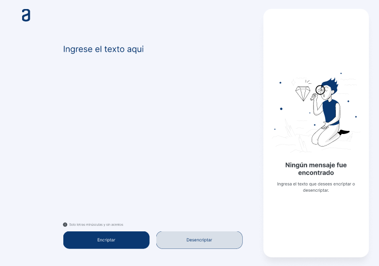

# Challenge Oracle Decoder

Challenge de [Alura Latam](https://www.aluracursos.com/) como parte de la beca otorgada por el programa [Oracle Next Education](https://www.oracle.com/mx/education/oracle-next-education/).



Este challenge permite encriptar y desencriptar un mensaje ingresado por el usuario, según el siguiente patrón.

```
  'a': 'ai',
  'e': 'enter',
  'i': 'imes',
  'o': 'ober',
  'u': 'ufat'
```
---

entre los **Requisitos** estaban:

* [x] Debe funcionar solo con letras minúsculas.
* [x] No deben ser utilizados letars con acentos ni caracteres especiales.
* [x] Debe ser posible convertir una palabra para la versión encriptada también devolver una palabra encriptada para su versión original.

**Extra**
* [x] Un botón que copie el texto encriptado/desencriptado para la sección de transferencia. 

Página de la práctica, en el siguiente enlace [link](https://hydr0bius.github.io/Challenge-Oracle-Decoder/).

---

Para la parte del **Js** se crearon tres funciones llamadas **encriptar**, **desencriptar**, **copiar** y uno último llamado **convertir** el cual hace aparecer el botón de copiar y desaparece la imagen junto con el texto que se tiene en el *textarea*.

En la parte de **encriptar** se creo el siguiente código:

```Js
function encriptar(){
    let texto = document.getElementById("texto").value;
    let title = document.getElementById("mensaje");

    let textoCifrado = texto
        .replace(/e/gi,"enter")
        .replace(/i/gi,"imes")
        .replace(/a/gi,"ai")
        .replace(/o/gi,"ober")
        .replace(/u/gi,"ufat");

        if (texto.length !=0){
            title.innerHTML = textoCifrado;
            title.classList.add("ajustar");
            convertir();
        }else{
            alert("Ingrese el texto que desea encriptar");
        }

};
```
En la parte de **desencriptar** se creo el siguiente código:
```Js
function desencriptar(){
    let texto = document.getElementById("texto").value;
    let title = document.getElementById("mensaje");
    let textoCifrado = texto
        .replace(/enter/gi,"e")
        .replace(/imes/gi,"i")
        .replace(/ai/gi,"a")
        .replace(/ober/gi,"o")
        .replace(/ufat/gi,"u");

    if(texto.length !=0){
            title.innerHTML = textoCifrado;
            title.classList.add("ajustar");
            convertir();
            
    }else{
        alert("debes ingresar algun texto!")
    }
};
```
En la parte de **copiar** se creo el siguiente código:
```Js
function copiar(){
    let title = document.getElementById("mensaje");

        navigator.clipboard.writeText(title.value);
};
```
La función convertir es usada cuando la sentencia *if* es verdadera en la función *encriptar/desencriptar*.
```Js
function convertir(){
    const contenido = document.getElementById("mensajeDos");
    const figure = document.getElementById("picture");
    let botonCopy = document.getElementById("btn-copy");
    
    figure.style.display = "none";
    contenido.style.display ="none";
    botonCopy.style.display = "block";
};
```